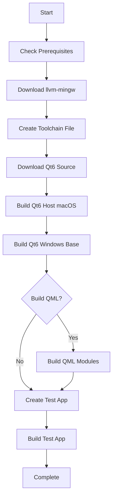

# Qt6 Cross-Compilation Installer for macOS

A comprehensive toolkit for building Qt6 applications on macOS Sequoia that can run on both macOS and Windows ARM64 devices.


## 📋 Overview

This project provides two ways to set up Qt6 cross-compilation on macOS:

1. **GUI Installer** - A beautiful Qt6 application with real-time progress tracking
2. **Command-Line Script** - Automated bash script for headless installation

Both tools build:
- ✅ Qt6 native tools for macOS (moc, uic, rcc, etc.)
- ✅ Qt6 libraries for macOS (Core, Widgets, Gui, etc.)
- ✅ Qt6 libraries for Windows ARM64 (cross-compiled)
- ⚙️ Optional: QML/QtQuick support
- 🎯 Test application that runs on both platforms

## 🎯 Features

### GUI Installer (`qt6-installer-gui`)

- 🎨 **Modern Interface** - Clean, intuitive design
- 📊 **Real-time Progress** - Visual progress bar and status updates
- 🌈 **Color-coded Output** - Easy-to-read verbose logging
  - Blue: Info messages
  - Green: Success
  - Orange: Warnings
  - Red: Errors
- ⏯️ **Process Control** - Start/Stop installation at any time
- 💾 **Smart Detection** - Checks existing installations
- 🔍 **Browse Files** - Easy script selection
- ⚡ **QML Toggle** - Optional QML support with checkbox

### Installation Script (`install.sh`)

- 🔍 **Smart Detection** - Skips already-installed components
- 📝 **Verbose Logging** - Full output of all build steps
- 🎨 **Color-coded Messages** - Clear status indicators
- 🚫 **No Prompts** - Fully automated (controlled via environment variables)
- ♻️ **Idempotent** - Safe to run multiple times
- ✅ **Verification** - Checks each component after installation

## 📦 What Gets Installed

```
~/
├── llvm-mingw/                      # Cross-compilation toolchain (700MB)
├── qt6-src/                         # Qt6 source code (2GB)
├── qt6-host-macos/                  # Qt6 for macOS (1.5GB)
│   ├── bin/
│   ├── lib/
│   ├── libexec/                     # Build tools (moc, uic, rcc)
│   └── plugins/
├── qt6-winarm64/                    # Qt6 for Windows ARM64 (1.5GB)
│   ├── bin/                         # DLLs
│   ├── lib/
│   └── plugins/
├── qt6-hello-test/                  # Test application
│   ├── main.cpp
│   ├── CMakeLists.txt
│   ├── build-macos/                 # macOS build
│   │   └── qt6hello
│   └── build-windows/               # Windows build
│       └── qt6hello.exe
└── llvm-mingw-toolchain.cmake       # CMake toolchain file
```

**Total disk space required:** ~6-8GB

## 🚀 Quick Start

### Prerequisites

```bash
# Install Homebrew (if not already installed)
/bin/bash -c "$(curl -fsSL https://raw.githubusercontent.com/Homebrew/install/HEAD/install.sh)"

# Install required tools
brew install cmake

# Optional but recommended for faster builds
brew install ninja
```

### Option 1: GUI Installer (Recommended)

1. **Build the GUI installer:**

```bash
cd ~/qt6-installer-gui/build
cmake ..
cmake --build .
```

2. **Run the installer:**

```bash
open qt6-installer-gui.app
```

3. **Follow the GUI:**
   - Click "Browse..." to select `install.sh`
   - Check "Build with QML" if you need QML support
   - Click "Start Installation"
   - Watch the progress in real-time!

### Option 2: Command-Line Installation

```bash
# Make script executable
chmod +x install.sh

# Run without QML (faster - 2 hours)
./install.sh

# Or with QML support (slower - 4 hours)
BUILD_QML=y ./install.sh
```

## ⏱️ Installation Time

| Component | Without QML | With QML |
|-----------|-------------|----------|
| Prerequisites | 1 min | 1 min |
| llvm-mingw | 2 min | 2 min |
| Qt6 Source | 10 min | 15 min |
| macOS Host Build | 60 min | 90 min |
| Windows Build | 30 min | 60 min |
| Test App | 2 min | 2 min |
| **TOTAL** | **~2 hours** | **~3-4 hours** |

*Times are approximate and vary based on CPU speed and internet connection*

## 📖 Usage Guide

### Testing the Installation

**Test macOS build:**
```bash
~/qt6-hello-test/build-macos/qt6hello
```

A window should appear with a button that counts clicks.

**Test Windows build:**
```bash
# Check the executable was created
file ~/qt6-hello-test/build-windows/qt6hello.exe

# Output should show:
# PE32+ executable (GUI) Aarch64 (ARM64)
```

Copy `qt6hello.exe` and required DLLs to a Windows ARM64 device to test.

### Building Your Own Applications

**For macOS:**
```bash
mkdir build && cd build
cmake .. -DCMAKE_PREFIX_PATH=$HOME/qt6-host-macos
cmake --build .
```

**For Windows ARM64:**
```bash
mkdir build-win && cd build-win
cmake .. \
  -DCMAKE_TOOLCHAIN_FILE=$HOME/llvm-mingw-toolchain.cmake \
  -DQT_HOST_PATH=$HOME/qt6-host-macos \
  -DCMAKE_PREFIX_PATH=$HOME/qt6-winarm64
cmake --build .
```

### Example CMakeLists.txt

```cmake
cmake_minimum_required(VERSION 3.16)
project(MyApp VERSION 1.0 LANGUAGES CXX)

set(CMAKE_CXX_STANDARD 17)
set(CMAKE_CXX_STANDARD_REQUIRED ON)

find_package(Qt6 REQUIRED COMPONENTS Core Widgets)
set(CMAKE_AUTOMOC ON)

add_executable(myapp main.cpp)
target_link_libraries(myapp Qt6::Core Qt6::Widgets)

if(WIN32)
    set_target_properties(myapp PROPERTIES WIN32_EXECUTABLE TRUE)
endif()
```

## 🔧 GUI Installer Details

### Building from Source

**Project structure:**
```
qt6-installer-gui/
├── main.cpp              # GUI application source
├── CMakeLists.txt        # Build configuration
└── build/                # Build directory
```

**Requirements:**
- Existing Qt6 installation (macOS)
- CMake 3.16+
- C++17 compiler

**Build commands:**
```bash
mkdir -p ~/qt6-installer-gui
cd ~/qt6-installer-gui

# Save main.cpp and CMakeLists.txt here

mkdir build && cd build
cmake .. -DCMAKE_PREFIX_PATH=$HOME/qt6-host-macos
cmake --build .
```

### GUI Features Explained

**Output Color Coding:**
- 🔵 **Blue** - Information and build progress
- 🟢 **Green** - Success messages and completion
- 🟠 **Orange** - Warnings (non-fatal issues)
- 🔴 **Red** - Errors and failures
- 🔷 **Cyan** - Section headers
- ⚫ **Gray** - Configuration details

**Progress Tracking:**
The progress bar estimates completion based on logged events:
- 5% - Prerequisites checked
- 10% - llvm-mingw downloaded
- 15% - Qt6 source ready
- 20% - Host build configured
- 30% - Host build in progress
- 50% - Host build complete
- 55% - Windows build configured
- 70% - Windows build in progress
- 85% - Windows build complete
- 95% - Test app built
- 100% - Installation complete

**Process Control:**
- **Start** - Begins installation with selected options
- **Stop** - Kills the running process (can be resumed later)
- **Browse** - File picker for install.sh location

## 📜 Script Details

### Environment Variables

| Variable | Values | Default | Description |
|----------|--------|---------|-------------|
| `BUILD_QML` | `y` / `n` | `n` | Enable QML/QtQuick support |
| `VERBOSE` | `0` / `1` | `1` | Show detailed output |
| `PARALLEL_JOBS` | number | `4` | Parallel build jobs |

**Examples:**
```bash
# Quick install without QML
./install.sh

# Full install with QML
BUILD_QML=y ./install.sh

# Use more CPU cores
PARALLEL_JOBS=8 ./install.sh

# Quiet mode (not recommended)
VERBOSE=0 ./install.sh
```

### Smart Component Detection

The script checks if components are already installed:

```bash
# Component check functions
is_installed "llvm-mingw"           # Checks compiler
is_installed "qt6-source"           # Checks source code
is_installed "qt6-host"             # Checks macOS build
is_installed "qt6-windows-base"     # Checks Windows base
is_installed "qt6-windows-qml"      # Checks Windows QML
```

When re-running, already-installed components are skipped:
```
[SUCCESS] llvm-mingw already installed at /Users/pedro/llvm-mingw
[SUCCESS] Qt6 host tools already built at /Users/pedro/qt6-host-macos
[INFO] Building Qt6 base (qtbase) for Windows ARM64...
```

### Exit Codes

| Code | Meaning |
|------|---------|
| `0` | Success |
| `1` | Prerequisites missing |
| `1` | Build failed |

## 🐛 Troubleshooting

### Common Issues

**Issue: "CMake not found"**
```bash
brew install cmake
```

**Issue: "Qt6Config.cmake not found"**

This means the Windows build didn't complete. Check:
```bash
ls ~/qt6-winarm64/lib/cmake/Qt6/
```

If empty, re-run the installation:
```bash
./install.sh
```

**Issue: GUI won't start**

Make sure Qt6 for macOS is installed:
```bash
ls ~/qt6-host-macos/lib/cmake/Qt6/Qt6Config.cmake
```

**Issue: Build takes too long**

Use Ninja for faster builds:
```bash
brew install ninja
```

**Issue: Out of disk space**

Qt6 requires ~8GB total:
- Source code: ~2GB
- macOS build: ~2GB
- Windows build: ~2GB
- Build artifacts: ~2GB

Clean up build directories after installation:
```bash
rm -rf ~/qt6-build-*
```

**Issue: Script stops with errors**

Check the verbose output for specific errors. Common causes:
- Network issues during download
- Insufficient disk space
- Missing build tools

To continue from where it stopped, just re-run the script. It will skip completed steps.

### Getting Help

The script provides detailed error messages. Look for:
```
[ERROR] Component failed
```

Check the verbose output above the error for the actual build failure.

## 🎓 How It Works

### Build Process Flow



### Cross-Compilation Explained

1. **Host Build (macOS)** - Creates build tools
   - `moc` - Meta-Object Compiler
   - `uic` - UI Compiler
   - `rcc` - Resource Compiler
   - Qt libraries for macOS

2. **Target Build (Windows ARM64)** - Uses host tools
   - Uses llvm-mingw for cross-compilation
   - References host tools via `QT_HOST_PATH`
   - Produces Windows ARM64 binaries

3. **Why Two Builds?**
   - Build tools must be native (macOS)
   - Libraries must match target (Windows ARM64)
   - CMake uses host tools during target build

## 📚 Resources

### Official Documentation
- [Qt6 Documentation](https://doc.qt.io/qt-6/)
- [Qt Cross-Compilation](https://doc.qt.io/qt-6/cmake-toolchains.html)
- [CMake Documentation](https://cmake.org/documentation/)

### Tools
- [llvm-mingw](https://github.com/mstorsjo/llvm-mingw) - LLVM-based MinGW toolchain
- [Qt Project](https://www.qt.io/) - Official Qt website

### Community
- [Qt Forum](https://forum.qt.io/)
- [Stack Overflow Qt Tag](https://stackoverflow.com/questions/tagged/qt)

## 🤝 Contributing

Found a bug or have a suggestion? Please:

1. Check existing issues
2. Create a detailed bug report with:
   - macOS version
   - Qt version
   - Full error output
   - Steps to reproduce

## 📝 Version History

### v1.0.0 (2026-01-10)
- ✨ Initial release
- ✅ GUI installer with real-time progress
- ✅ Automated installation script
- ✅ Smart component detection
- ✅ Verbose logging
- ✅ QML support (optional)
- ✅ Test application included

## 🔐 System Requirements

### Minimum
- macOS Sequoia 15.2+
- 8GB free disk space
- 8GB RAM
- Xcode Command Line Tools
- CMake 3.16+
- 2-4 hours installation time

### Recommended
- macOS Sequoia 15.2+
- 16GB free disk space
- 16GB RAM
- Ninja build system
- Fast internet connection
- Multi-core CPU (4+ cores)

## ⚖️ License

This installer toolkit is provided as-is for educational and development purposes.

- Qt6 is licensed under LGPL/GPL
- llvm-mingw is licensed under Apache 2.0
- This installer script is provided without warranty

## 🙏 Acknowledgments

- Qt Project for the Qt framework
- Martin Storsjö for llvm-mingw
- The open-source community

---

**Built with ❤️ for the Qt community on macOS**

*Last updated: January 10, 2026*
